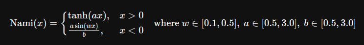
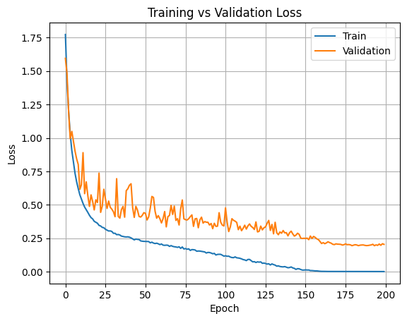
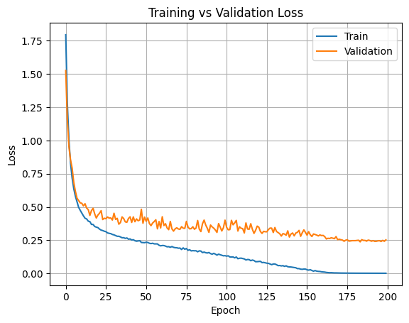
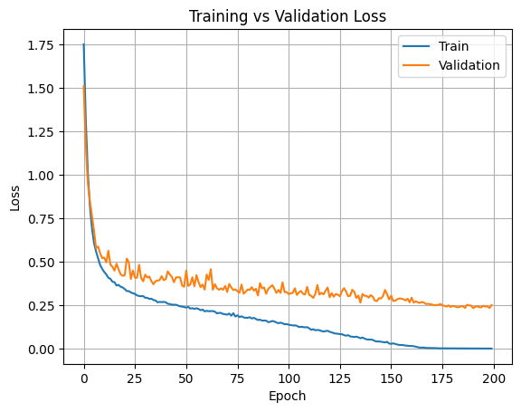

# Nami
**Official Repository for Nami: an adaptive self regulatory activation function**


I tested **Nami**, **Swish** and **Mish** with the same weight initialization on ResNet-18, on CIFAR-10

```python
def seed_everything(seed=42):
    import random, os
    import numpy as np
    import torch

    random.seed(seed)
    os.environ["PYTHONHASHSEED"] = str(seed)
    np.random.seed(seed)
    torch.manual_seed(seed)
    torch.cuda.manual_seed(seed)
    torch.cuda.manual_seed_all(seed)

    torch.backends.cudnn.deterministic = True
    torch.backends.cudnn.benchmark = False
    torch.use_deterministic_algorithms(True, warn_only=True)

seed_everything(42)
```

Ran the training for 200 epochs and `Nami` showed very stable looses and that is because of `tanh(x * a)` in the positive and `a * sin(x * w) / b` in the negative domain. 




And here are the stats:



- **Nami**: 
    Validation Accuracy `94.81`,
    Training Loss `0.0015`,
    Validation Loss `0.1963`



- **Mish**:
    Validation Accuracy `94.09`,
    Training Loss `0.0032`,
    Validation Loss `0.2424`



- **Swish/SiLU**:
    Validation Accuracy `94.06`,
    Training Loss `0.0024`,
    Validation Loss `0.2347`


